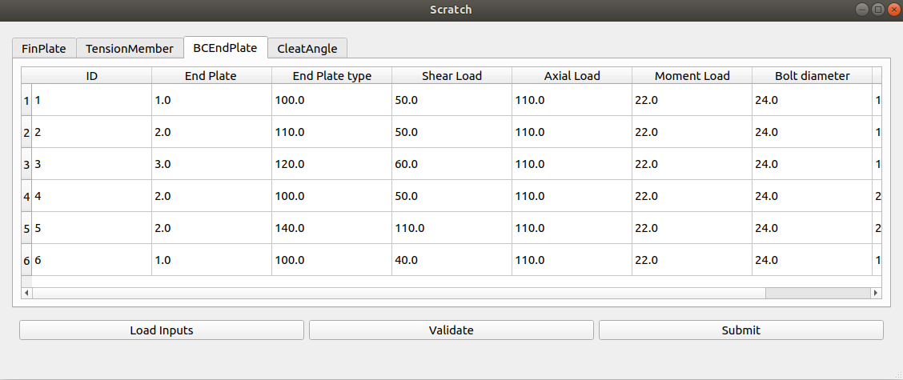

# fsf_2020_screening_task : Develop a desktop application
Scratch is a PyQt Desktop App that can be used to validate input Steel Modules' data and generate corresponding text files with a JSONified version of the input spreadsheet data.



## Yaksh Username and Email
* Username : makrandr1999
* Email    : makrand.r@somaiya.edu

## How it works
* Users can load the data in the form of a spreadsheet(.xlsx).
* The input file can be validated across different parameters such as :
  * ID values should be unique.
  * Input values should be numeric.
* Upon clicking the submit button, new text files are created for each row of the validated input file.
* These files follow a dictionary format where the header value is a key and the cell value is a value and are automatically saved as 'Modulename_ID.txt' in a newly created 'Modulename' Folder in the working directory.
* _Please ensure that the sheetnames in the input xlsx file correspond to the different module names._

## Requirements
* PyQt5
* Python 3.6.7

## Installation

* Create a new directory for the project and navigate to that directory.

```bash
mkdir ProjectDirectory
cd ProjectDirectory
```
* Make a virtual environment and activate it.
```bash
python3 -m venv myvenv
source myvenv/bin/activate
```
* Upgrade to the latest version of pip.
```bash
python -m pip install --upgrade pip
```
* Install PyQt and other dependencies using requirements.txt .
```bash
pip install -r requirements.txt
```
## Usage
* Navigate to your project folder and run the following command to launch the app:

```bash
python3 scratch.py 
```
* Alternatively, you can directly launch the app by running the executable application from the dist folder.
